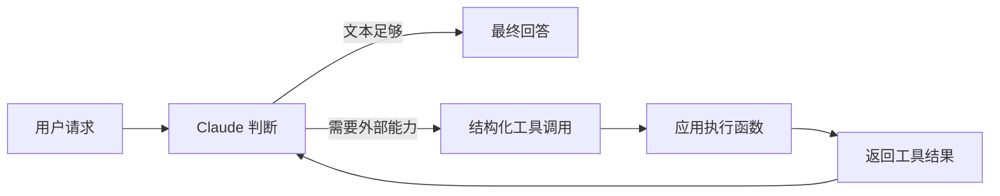

# 从一次请求到可控系统：Claude API 工程的七层进阶

把大语言模型接进应用，最容易产生的错觉是：只要能发出一次请求、拿回一段文字，工程就完成了。课程《Building with the Claude API》呈现的恰好是相反的路线。一次最初只有文本的用户请求，会逐步获得历史、约束、评测、外部工具、检索上下文、协议边界和执行反馈，最后才可能成为一个相对可靠的工作流或智能体。真正的学习对象不是某个神奇提示词，而是**一次请求在系统中如何改变状态，以及开发者如何在每次变化后重新建立控制**。

本文只依据 2026 年 8 月 8 日提供的 Anthropic Skilljar 课程页离线快照。课程页总览称课程包含 **84 lectures、8.1 小时视频和 10 个测验**；但同一页七个 section 的 lessonCount 分别为 **16、16、14、10、12、8、11**，相加得到 **87**。资料没有解释 84 与 87 的差异，本文不选择其中一个“更可信”的数字，也不把差异擅自解释为测验、重复课或隐藏课。下面的七章结构仅按页面明确列出的七个 section 展开。

读完后，读者应能重建一个从简单 API 调用到工作流／智能体的系统模型，并完成课程页列出的七个学习目标：发起并处理请求；实现多轮、流式和结构化输出；系统评测提示词；创建自定义工具；构建混合检索与重排的 RAG；理解 MCP 如何连接数据与能力；区分常见工作流与智能体架构。前置条件是 Python、JSON 基础和可用的 Anthropic API key。

## 第一章　先让请求成立：模型、消息与上下文

📍 **状态 1：一次用户输入刚进入开发者服务器；它还不是“对话”，只是等待被包装成 API 请求的文本。**

最小调用需要模型名、`max_tokens` 和 `messages`。API key 应留在服务器端，通过环境变量加载，不应下发到浏览器或移动客户端。课程给出的基本链路是：客户端把输入发给开发者服务器，服务器通过 SDK 或 HTTP 调用 Anthropic API，模型生成结果，API 再把内容、用量和停止原因返回服务器。`max_tokens` 是输出上限，不是要求模型必须写到的目标长度；`stop_reason` 则告诉程序为什么停止。只提取 `message.content[0].text` 适合展示，但生产代码通常还需要保留元数据，用于记录成本、诊断截断和决定是否重试。

模型选择首先是系统约束，而不是品牌偏好。课程把 Opus、Sonnet、Haiku 描述为面向不同优先级的家族：复杂推理与规划优先时偏向 Opus；速度和高吞吐优先时偏向 Haiku；多数需要平衡智能、速度与成本的应用偏向 Sonnet。更重要的工程结论是：同一产品未必只用一个模型。分类、批量预处理和主任务推理可以使用不同档位，让模型选择服从任务，而非让所有任务服从同一模型。

一次请求成功后，最常见的误解是“API 会记住刚才说过什么”。课程明确指出，每次 API 请求彼此独立；所谓多轮对话，是应用自己维护消息列表，并在下一次调用时重新发送相关的 user 与 assistant 历史。于是请求的状态从一条文本变为一个有顺序的消息序列。应用必须追加模型回复，再追加新用户问题，才能让后续回答获得上下文。这个事实也暴露出第一个成本边界：历史越长，请求携带的上下文越多，延迟和 token 使用通常也越值得关注。

系统提示词则在消息内容之外增加行为约束。课程把它用于规定角色、语气和处理方式，例如让数学导师给提示而非直接给答案。温度控制生成时选择低概率 token 的机会：低温适合提取和一致性任务，高温适合创意探索。流式响应不改变最终推理任务，却改变用户感知：服务器逐段转发 `content_block_delta`，界面无需等待整段完成；同时应通过最终消息接口组装完整回复，供存储和下一轮使用。

结构化输出展示了“控制”与“解析”的关系。课程用 assistant prefill 指定开头、用 stop sequence 截断结尾，从而减少 Markdown 围栏和解释性文字。这个方法能提高输出可直接使用的概率，但不能替代 JSON 解析和字段校验。常见错误是看到一次漂亮的 JSON 就把随机生成文本当成稳定接口。正确做法是把预填充视为生成约束，把解析、schema 检查和错误处理视为程序约束，两者缺一不可。

**本章完成的目标**：读者能够描述一次 Messages API 请求的组成，解释多轮历史为何由应用维护，并说明流式输出与结构化输出分别解决体验和接口问题。

## 第二章　把“看起来有效”变成可比较：提示工程与评测

📍 **状态 2：请求已有消息历史和输出约束；新问题是，我们仍不知道提示词在不同输入上是否可靠。**

课程没有把提示工程教成修辞灵感，而是把它放进评测循环。典型流程是：写出基线提示词，建立测试数据集，把每条输入代入提示模板，调用模型生成结果，为结果评分，随后修改提示并重复。数据集可以只有少数人工样例，也可以由模型辅助生成更多任务；无论规模大小，它的作用都是固定比较条件，避免开发者只凭对某一条“演示输入”的印象下结论。

假设要做一个 AWS 代码助手，要求只返回 Python、JSON 配置或正则表达式。一个可操作的练习是准备覆盖正常任务、含糊任务和边界任务的数据集。对每个样例运行同一版本提示词，保存输出，再用两类评分器检查。代码评分器适合可机械判断的性质，例如“是否只有一个代码块”“能否被 JSON 解析”“是否包含禁止的解释文字”；模型评分器适合相关性、完整性和表达质量等较难写成规则的维度。模型评分不是客观真理，评分提示词本身也需要定义量尺、样例和输出格式。

这揭示了一个重要分工：能用代码精确判断的，不要交给另一个模型猜；只能依赖语义判断的，也不要伪装成完全确定的布尔规则。把两类分数组合起来，才可能看到“语法合格但答非所问”或“语义很好但机器无法解析”等不同失败。平均分能够比较版本，却可能掩盖某类关键样例的退步，因此至少应保留逐样例结果，并专门检查最低分和高风险案例。

在提示词本身，课程强调四种基础手段。第一是清楚直接，明确任务而非依靠暗示；第二是具体，补充受众、格式、限制和成功条件；第三是用 XML 标签分隔文档、指令或示例，降低不同内容混在一起的歧义；第四是提供输入—输出示例，让模型从可观察模式学习期待。它们的共同本质不是“写得更长”，而是减少模型需要自行猜测的部分。

一个常见捷径是边改提示边换测试集，然后把分数提升归因于提示词。这样比较没有共同基线。另一个错误是让同一个模糊标准同时生成答案和打分，再把高分称为事实。更稳妥的顺序是：先冻结数据和评分契约，再比较提示版本；发现评分器漏洞时，明确创建新一轮评测，而不是悄悄覆盖旧结果。

**本章完成的目标**：读者能够搭建“数据集—生成—代码评分／模型评分—迭代”的最小评测管线，并用直接、具体、XML 分区和示例四种手段修改提示词。

## 第三章　让请求采取行动：工具调用与闭环

📍 **状态 3：请求经过评测后可以较稳定地表达意图；新问题是，模型只能生成内容，不能独自读取真实系统或执行外部动作。**

工具使用把模型从文本生成器变成“提出结构化调用建议的决策层”。开发者先实现普通函数，再把每个函数描述成工具 schema：名称、用途、参数类型、必填字段和字段说明。模型收到用户问题和工具定义后，可能返回文本块，也可能返回 tool-use 块。应用必须按块类型分派处理，使用模型给出的参数调用真实函数，并把结果作为 tool result 送回模型。最终给用户的自然语言答案通常发生在这次回传之后。

这一闭环可简化为：

**图的含义：模型选择工具，但应用拥有执行权；工具结果必须回到消息历史，模型才能继续。**

例如用户问“把文档 A 中的旧标题替换为新标题”。模型不应假装修改成功，而应选择文本编辑工具，给出文档标识、旧字符串和新字符串。程序验证文档是否存在、旧字符串是否匹配、调用是否有权限，再返回成功或错误。模型随后依据真实结果解释完成情况。工具描述如果含糊，模型可能选错函数；参数 schema 如果过宽，程序可能收到危险输入；函数执行如果没有错误返回，模型又可能在失败后编造成功。因此，可靠性来自模型判断与程序验证共同组成的边界。

多轮工具交互要求完整保存 assistant 的 tool-use 内容和对应 tool result。一次任务也可能需要多个工具：先查时间，再计算时长，最后设置提醒。课程还介绍批量工具调用，把可并行的多个操作一次发出；以及以工具 schema 获取结构化数据，相比只靠文本提示，schema 能更明确地规定字段。内置或示例能力还包括文本编辑、Web Search，以及代码执行与 Files API 等，但课程快照并不授权本文实际联网或执行这些服务。

常见错误之一是把工具函数的 Python 签名直接暴露，却不给模型解释每个参数的语义。另一个是把模型产生的参数当作可信输入，跳过身份、权限、范围和副作用检查。第三个是执行完工具却没有把结果按正确角色和引用关系放回消息列表，导致模型无法把动作纳入后续推理。工具调用不是“Claude 直接操作世界”，而是模型、宿主程序和外部系统之间的一份显式协议。

**本章完成的目标**：读者能够创建自定义函数与工具 schema，处理 tool-use 块，执行并回传结果，并理解多工具和批量调用的适用条件。

## 第四章　给请求可追溯的知识：RAG、混合检索与重排

📍 **状态 4：请求现在能调用函数；新问题是，回答需要大量私有或动态文档，而这些内容既不在当前消息里，也不应全塞进提示词。**

检索增强生成（RAG）的核心不是让模型“拥有数据库”，而是在回答前从外部语料选出少量相关片段，放入上下文。完整管线包括文档切分、索引、查询检索、候选合并或重排、把片段交给模型生成。每一层都可能丢失信息，因此不能只看最终答案是否流畅。

切分首先决定可检索单元。块太大，会把无关文字一并带入并浪费上下文；块太小，关键概念可能与限定条件分离。课程讨论字符切分、句子切分以及保留重叠等策略。一个实用检查是：如果命中的片段单独拿出来，是否仍包含问题需要的主语、结论和条件？如果否，应该调整块边界、加入上下文或允许相邻块共同进入候选。

向量 embedding 把文本映射为数字表示，适合寻找语义相近但用词不同的内容；BM25 是词法检索，对产品代码、专有名词和精确短语更敏感。两者不是互相替代。混合检索可以分别从向量索引和 BM25 索引取候选，合并去重，再交给 reranker 根据问题重新排序。多索引架构让系统同时利用“意思像”和“字面匹配”，重排则把较贵的相关性判断集中在较小候选集上。

举例说，用户查询“缓存断点为什么失效”。纯向量检索可能找到一般性的缓存说明，却漏掉文档中的精确字段名；纯 BM25 可能命中含“breakpoint”的配置片段，却忽略前文对前缀一致性的解释。混合召回先保住两类证据，重排再把同时回答原因与规则的片段置前。最终生成时，模型只能依据实际送入的片段回答；检索不到的事实不能因语言连贯而补写。

课程还介绍 contextual retrieval：在嵌入或索引前为块补充其在原文中的语境，降低脱离章节后的歧义。它增加处理成本，也可能把生成的上下文误差写进索引，因此仍需评测。一个完整 RAG 评测至少要区分“正确证据是否进入候选”“是否排到可用位置”“模型是否忠实使用证据”。只评最终答案，会把召回错误、排序错误和生成错误混成一团，无法知道该修哪层。

**本章完成的目标**：读者能够解释切分、embedding、BM25、混合候选、reranking 与 contextual retrieval 在 RAG 中的不同职责，并画出从查询到证据上下文的完整路径。

## 第五章　把能力做成可连接部件：MCP 的工具、资源与提示

📍 **状态 5：请求已经能检索并调用应用内函数；新问题是，每接一个外部系统都手写一套集成，能力难以复用。**

Model Context Protocol（MCP）把外部能力和数据组织成客户端与服务器之间的标准消息交换。课程中的典型路径是：应用中的 MCP client 向 MCP server 请求工具列表，把工具描述交给 Claude；模型提出调用后，client 再发 call-tool 请求，server 执行并返回结果，结果沿原路回到模型和用户。client 是连接与转换的中介，通常不亲自实现工具业务逻辑；传输方式可以变化，重要的是双方遵循协议消息。

课程把 MCP 原语分成三类，区别主要在“谁控制使用时机”：

| 原语 | 控制者 | 主要用途 | 示例 |
|---|---|---|---|
| Tools | 模型 | 执行动作或计算 | 读取、编辑文档 |
| Resources | 应用 | 读取并呈现数据 | 文档列表、指定文档内容 |
| Prompts | 用户 | 启动预定义工作流 | “格式化这份文档”命令 |

工具可以用 Python MCP SDK 的装饰器和类型声明定义，SDK据此生成 schema。开发时可通过 Server Inspector 列工具、填参数、直接运行，以便把服务器问题与模型选择问题分开。资源使用 URI：静态资源有固定地址，模板资源则把文档 ID 等变量放进 URI。客户端读取后应根据 MIME type 决定按 JSON 解析还是保留文本。提示则由服务器提供经过设计的消息模板，客户端传入运行时参数，再把返回消息交给模型。

这三类原语不能只按数据格式区分。若希望模型在需要时自主选择“查库存”，它更像 tool；若应用需要先加载下拉列表，它更像 resource；若用户点击按钮明确启动“审阅合同”，它更像 prompt。错误分类会造成控制权错位：把敏感动作做成模型可随意调用的工具，或把需要模型判断的动作藏在固定 UI 流程里，都可能降低可用性或安全性。

课程示例把 client 和 server 放在同一项目中便于教学，但也明确指出现实项目常只实现其中一侧。client 要管理 session 生命周期和清理；server 要验证文档 ID、参数和错误。MCP 减少重复集成劳动，却不会自动解决认证、权限、审计或业务语义。协议标准化的是连接表面，不是每个系统的治理责任。

**本章完成的目标**：读者能够说明 MCP client/server 调用链，区分 tools、resources、prompts，并理解如何用 inspector、URI、MIME type 和会话管理完成基本集成。

## 第六章　进入真实工作环境：Claude Code 与 Computer Use

📍 **状态 6：请求的能力已经能通过 MCP 复用；新问题是，它要面对真实代码库和图形界面，而环境状态会在每个动作后改变。**

课程把 Claude Code 与 Computer Use 放在同一章，关键共同点并非“自动化很强”，而是它们都必须观察环境。Claude Code 面对文件和命令行：修改前读取当前代码，执行后查看输出，再依据错误继续。课程示例包括用 MCP server 扩展能力、并行运行 Claude Code 任务和自动化调试。Computer Use 面对屏幕：点击或输入后再次截图，因为程序无法只凭动作名称确定界面跳转、弹窗或加载结果。

环境检查是智能体可靠性的基本反馈回路。假设一个任务要生成带字幕的视频。工具返回“命令执行成功”不等于视频可用；系统可以调用 Whisper 生成带时间戳字幕，用 FFmpeg 抽取不同时间点画面，再检查字幕是否出现、音频是否对齐。代码任务同理：写文件之后应读取差异、运行测试、检查错误，而非把“工具没有报错”当作完成。

并行化也不是无条件加速。若多个代码任务修改同一文件，它们会竞争状态；只有输入相互独立、结果能可靠合并时才适合并行。自动调试则需要明确停止条件，否则系统可能在错误假设上反复修改。一个稳健循环至少包含：观察当前状态、提出最小动作、执行、重新观察、比较预期与实际、决定继续或退出。

Computer Use 的边界尤其值得强调。屏幕像素给模型的是可见状态，不等于它拥有对操作后果的完整知识。涉及发送、购买、删除或公开发布时，应用仍需权限和确认策略。课程快照说明 UI 自动化的工作方式，但没有提供足以支持本文宣称任何特定部署达到安全或成功率标准的评测数据。因此，这一章能得出的结论是“观察反馈不可少”，而不是“自动化已经可靠地替代人工”。

**本章对应课程覆盖**：读者能够理解 Claude Code、MCP 扩展、并行任务、自动调试与 Computer Use 的基本模式，并把环境检查作为每次动作后的必要步骤。它同时为下一章“何时让模型自己规划”提供前提。

## 第七章　决定谁来规划：工作流、路由与智能体

📍 **状态 7：请求已经拥有消息、评测、工具、知识、协议和环境反馈；最后的问题是，步骤应由程序预先规定，还是交给模型动态决定。**

课程给出的首要规则很朴素：步骤已知时使用 workflow；任务细节无法预先确定时才使用 agent。工作流把大任务拆成明确调用，通常更准确、更容易测试，也更可靠；智能体让 Claude 用一组工具动态规划，适应性更高，但成功路径不可预测，测试也更困难。用户真正需要的是能工作的产品，而不是看起来更“自主”的架构。

三种常见工作流分别解决不同结构的问题。并行化把独立子问题同时展开，再聚合结果。例如分别评估金属、聚合物和陶瓷对某零件的适用性，最后统一推荐。链式工作流把任务串行分解，让每一步只处理一种约束；当一个巨大提示总漏要求时，也可以先生成，再用专门步骤修正违规项。路由工作流先分类，再把输入送入专用管线，例如编程主题进入教育脚本模板，冲浪主题进入娱乐脚本模板。

另一种模式是 evaluator—optimizer：生产者生成候选，评估者检查，未达标便带反馈回到生产步骤。课程以图片转 3D 模型为例：描述图片、用 CADQuery 建模、渲染、比较原图，不准确就迭代。关键不在循环本身，而在评估是否可操作，以及退出条件是否明确。如果“看起来不错”没有量尺，循环只会放大成本。

智能体适合用户目标多变、所需步骤取决于中间观察的任务。工具设计应偏向少量抽象、可组合的能力，而不是大量只能完成单一步骤的超专用按钮。例如当前时间、时长计算、设置提醒三个工具，既能回答时间，也能组合处理“下周三提醒我健身”。但抽象工具扩大组合空间，也扩大风险空间，所以环境观察、权限边界和结果验证必须随之加强。

从七章回看，一次请求的状态变化可以压缩成下面的判断链：

1. 先建立可审计的 API 请求与消息历史；
2. 用固定数据和评分器判断提示是否稳定；
3. 需要外部动作时引入工具闭环；
4. 需要文档知识时建立可分层评测的 RAG；
5. 需要复用连接时用 MCP 明确控制权；
6. 进入真实环境后，每次动作都重新观察；
7. 步骤已知就固化工作流，只有路径依赖中间状态时才升级为智能体。

这也给出了课程七个学习目标之间的依赖：API 请求是底座，多轮与流式是状态和体验，评测提供比较尺度，工具让系统行动，RAG让系统找到证据，MCP让能力可连接，工作流与智能体则决定整个系统如何编排。任何上层能力都不能补偿下层缺失：没有评测的智能体不会因“更自主”而更可靠；没有权限检查的 MCP 工具不会因“标准化”而更安全；没有召回诊断的 RAG 也不会因答案流畅而自动正确。

### 常见误区清单

- 把 API 当成自动记忆对话的服务，而没有保存并重传消息历史。
- 把一次成功演示当成提示词质量证据，而没有固定测试集。
- 把模型给出的工具参数当成可信输入，忽略验证和权限。
- 只评 RAG 最终回答，不区分召回、排序与生成失败。
- 把 MCP 当作自动解决治理的万能层，而忽略认证和业务边界。
- 把工具“成功返回”当成任务完成，不重新检查文件或界面。
- 为了显得先进而使用 agent，即使步骤其实完全可预先定义。

### 结语与证据边界

课程真正连贯的工程主线，是持续收回控制权：请求越能访问真实数据和执行真实动作，系统越需要显式状态、评测、协议、观察与停止条件。模型能力决定可能做什么，应用架构决定这些能力是否可预测、可诊断、可约束。

本文没有验证课程视频中的代码能否在 2026 年 8 月的最新 SDK 上直接运行，也没有调用 Anthropic API、MCP Inspector、Claude Code、Computer Use 或任何外部服务。唯一证据是给定课程页快照及其内嵌课程笔记，因此文中不宣称 API 版本兼容性、性能数字、生产成功率或安全保证。页面的 **84 lectures** 与章节计数合计 **87 lessons** 的矛盾保持未解释。本文可以帮助读者重建课程公开的概念模型，但不能替代逐课实验和针对当前版本的官方文档核验。

### Further Reading（限于本次已提供材料）

由于本次禁止联网且只提供一份第一方课程快照，下面不是外部书目，而是快照中最值得回看的四组原始课程材料；它们用于延伸实践，不承担本文的前置解释。

1. 课程页总览中的七项 Learning objectives 与七个 Course sections：用来核对学习范围和章节映射。
2. 内嵌课程笔记的 “A Typical Eval Workflow”“Model Based Grading”“Code Based Grading”：用来落实评测循环。
3. “The Full RAG Flow”“BM25 Lexical Search”“Reranking Results”“Contextual Retrieval”：用来重建检索管线。
4. “MCP Review”“Environment Inspection”“Workflows vs Agents”：用来检查控制权、反馈和架构选择。

---

**资料来源**：[Anthropic Skilljar《Building with the Claude API》课程页](https://anthropic.skilljar.com/claude-with-the-anthropic-api)于 2026-08-08 获取的离线快照。本文无联网补充来源。
